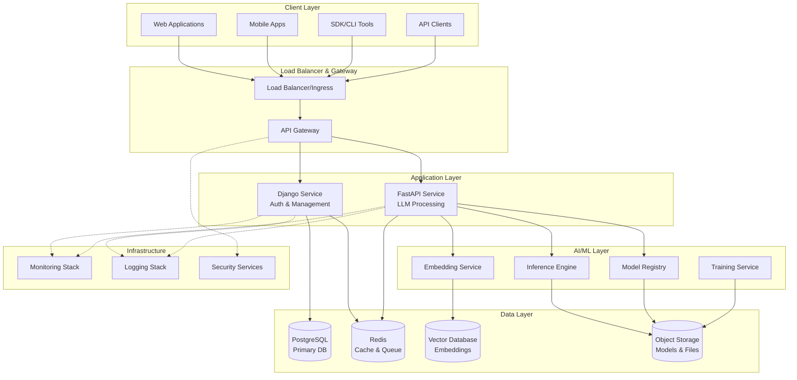

# System Architecture Overview

This document provides a comprehensive overview of the LLM API Platform architecture, designed for enterprise-scale deployment with high availability, security, and performance.

## High-Level Architecture



## Core Components

### 1. API Gateway Layer

**Purpose**: Request routing, authentication, rate limiting, and API management.

**Components**:
- **Load Balancer**: Distributes incoming requests across multiple service instances
- **API Gateway**: Centralized entry point with authentication, rate limiting, and request routing
- **SSL Termination**: Handles HTTPS encryption/decryption

**Key Features**:
- Request/response transformation
- API versioning support
- Circuit breaker patterns
- Request/response caching
- Comprehensive logging and metrics

### 2. Service Layer

#### Django Service (Management & Auth)
**Port**: 8001
**Responsibilities**:
- User authentication and authorization
- API key management
- Billing and usage tracking
- Administrative interfaces
- User management
- Organization management
- Audit logging

**Key Modules**:
- `authentication/` - JWT and API key auth
- `billing/` - Usage tracking and invoicing
- `users/` - User and organization management
- `security/` - RBAC and audit logging

#### FastAPI Service (AI/ML Processing)
**Port**: 8000
**Responsibilities**:
- LLM inference processing
- Chat completions
- Text embeddings
- Function calling
- Streaming responses
- Model management

**Key Modules**:
- `api/v1/` - OpenAI-compatible endpoints
- `core/` - ML inference engine
- `models/` - Pydantic data models
- `services/` - Business logic layer

### 3. AI/ML Infrastructure

#### Model Registry
**Purpose**: Centralized model storage, versioning, and metadata management.

**Features**:
- Model versioning and rollback
- Hot-swapping without downtime
- Performance monitoring
- Resource allocation
- A/B testing support

#### Inference Engine
**Purpose**: High-performance model inference with optimizations.

**Features**:
- GPU acceleration support
- Model quantization (4-bit, 8-bit)
- Batch processing
- Dynamic scaling
- Memory optimization

#### Training Service
**Purpose**: Fine-tuning and custom model training.

**Features**:
- LoRA and QLoRA fine-tuning
- Distributed training support
- Hyperparameter optimization
- Training job management
- Model evaluation

### 4. Data Storage Layer

#### PostgreSQL (Primary Database)
**Purpose**: Persistent storage for application data.

**Schema Areas**:
- User and organization data
- API keys and authentication
- Usage metrics and billing
- Model metadata
- Fine-tuning jobs

**Configuration**:
- Master-replica setup for read scaling
- Connection pooling with PgBouncer
- Automated backups with point-in-time recovery
- Query optimization and indexing

#### Redis (Cache & Message Queue)
**Purpose**: High-speed caching and asynchronous job processing.

**Use Cases**:
- API response caching
- Session storage
- Rate limiting counters
- Background job queue
- Real-time metrics

**Configuration**:
- Redis Cluster for high availability
- Separate instances for different use cases
- Persistence configuration for durability
- Memory optimization

#### Vector Database
**Purpose**: Efficient storage and retrieval of embeddings.

**Options**:
- Pinecone (managed)
- Chroma (open-source)
- FAISS (in-memory)
- pgvector (PostgreSQL extension)

**Features**:
- Similarity search
- Metadata filtering
- Horizontal scaling
- Real-time updates

#### Object Storage (S3-Compatible)
**Purpose**: Storage for large files and model artifacts.

**Contents**:
- Pre-trained model weights
- Fine-tuned models
- Training datasets
- User-uploaded files
- Backup archives

### 5. Observability Stack

#### Monitoring (Prometheus + Grafana)
**Metrics Collection**:
- Application metrics (request rates, latency, errors)
- Infrastructure metrics (CPU, memory, disk, network)
- Business metrics (API usage, costs, user activity)
- Custom metrics (model performance, inference time)

**Alerting**:
- Multi-channel notifications (Slack, email, PagerDuty)
- Escalation policies
- Threshold-based and anomaly detection
- Runbook integration

#### Logging (ELK Stack)
**Components**:
- **Elasticsearch**: Log storage and indexing
- **Logstash**: Log processing and transformation
- **Kibana**: Log visualization and analysis
- **Filebeat**: Log shipping

**Log Types**:
- Application logs (structured JSON)
- Access logs (request/response details)
- Audit logs (security events)
- Error logs (exceptions and failures)

#### Distributed Tracing (Jaeger)
**Purpose**: Request tracing across microservices.

**Features**:
- End-to-end request tracing
- Performance bottleneck identification
- Service dependency mapping
- Error correlation

## Deployment Architecture

### Kubernetes Cluster Setup

```yaml
# Production cluster configuration
Cluster:
  - Control Plane: 3 nodes (HA)
  - Worker Nodes: 5+ nodes
  - GPU Nodes: 2+ nodes (for inference)

Namespaces:
  - llm-api-prod: Production workloads
  - monitoring: Observability stack
  - security: Security services
```

### Service Mesh (Optional)
**Technology**: Istio or Linkerd

**Benefits**:
- Service-to-service encryption
- Traffic management and routing
- Observability and monitoring
- Policy enforcement

## Security Architecture

### Authentication & Authorization
- **API Keys**: Server-to-server authentication
- **JWT Tokens**: User session management
- **OAuth 2.0**: Third-party integrations
- **RBAC**: Role-based access control

### Data Protection
- **Encryption at Rest**: Database and file encryption
- **Encryption in Transit**: TLS 1.3 for all communications
- **Key Management**: Dedicated key management service
- **Data Masking**: PII protection in logs and responses

### Network Security
- **WAF**: Web Application Firewall
- **DDoS Protection**: Traffic filtering and rate limiting
- **Network Policies**: Kubernetes network segmentation
- **VPC**: Private network isolation

## Scalability Considerations

### Horizontal Scaling
- **Service Instances**: Auto-scaling based on metrics
- **Database**: Read replicas and sharding
- **Cache**: Redis clustering
- **Load Balancing**: Multiple availability zones

### Vertical Scaling
- **GPU Resources**: Dynamic allocation for inference
- **Memory Optimization**: Model quantization and caching
- **CPU Optimization**: Async processing and connection pooling

### Performance Optimization
- **Caching Strategy**: Multi-level caching
- **CDN**: Static asset delivery
- **Database Optimization**: Query optimization and indexing
- **Model Optimization**: Quantization and pruning

## Disaster Recovery

### Backup Strategy
- **Database Backups**: Automated daily backups with retention
- **File Backups**: Model and data replication
- **Configuration Backups**: Infrastructure as code

### High Availability
- **Multi-Region Deployment**: Active-active or active-passive
- **Failover Mechanisms**: Automatic failover for critical services
- **Data Replication**: Cross-region data synchronization

### Recovery Procedures
- **RTO Target**: 4 hours (Recovery Time Objective)
- **RPO Target**: 1 hour (Recovery Point Objective)
- **Runbooks**: Documented recovery procedures
- **Testing**: Regular disaster recovery drills

## Technology Stack

### Programming Languages
- **Python**: Primary language for AI/ML services
- **JavaScript/TypeScript**: Web interfaces and tooling
- **Go**: High-performance components (optional)
- **Bash**: Infrastructure automation scripts

### Frameworks & Libraries
- **FastAPI**: High-performance API framework
- **Django**: Web framework with admin interface
- **PyTorch/Transformers**: ML model handling
- **SQLAlchemy**: Database ORM
- **Pydantic**: Data validation and serialization

### Infrastructure
- **Kubernetes**: Container orchestration
- **Docker**: Containerization
- **Helm**: Package management
- **Terraform**: Infrastructure as code
- **ArgoCD**: GitOps deployment

### Databases & Storage
- **PostgreSQL**: Relational database
- **Redis**: In-memory data store
- **MinIO/S3**: Object storage
- **Vector DB**: Embedding storage

## Performance Characteristics

### Throughput
- **API Requests**: 10,000+ requests/second
- **Concurrent Users**: 1,000+ simultaneous users
- **Model Inference**: 100+ tokens/second per GPU

### Latency
- **API Response Time**: <100ms (non-inference endpoints)
- **Model Inference**: <30s for typical completions
- **Embedding Generation**: <5s for batch processing

### Resource Requirements
- **CPU**: 16+ cores per service instance
- **Memory**: 32GB+ per inference node
- **GPU**: V100/A100 for large models
- **Storage**: 1TB+ for model storage

## Compliance & Standards

### Security Compliance
- **SOC 2**: Security, availability, and confidentiality
- **GDPR**: Data protection and privacy
- **HIPAA**: Healthcare data protection (if applicable)
- **ISO 27001**: Information security management

### API Standards
- **OpenAPI 3.0**: API specification
- **REST**: Architectural style
- **JSON**: Data interchange format
- **HTTP/2**: Protocol optimization

## Future Considerations

### Planned Enhancements
- Multi-modal model support (text + images)
- Real-time collaboration features
- Advanced fine-tuning capabilities
- Edge deployment options

### Scalability Roadmap
- Auto-scaling improvements
- Cross-region deployment
- Advanced caching strategies
- Performance optimizations

This architecture provides a solid foundation for enterprise-grade LLM API services while maintaining flexibility for future growth and feature additions.